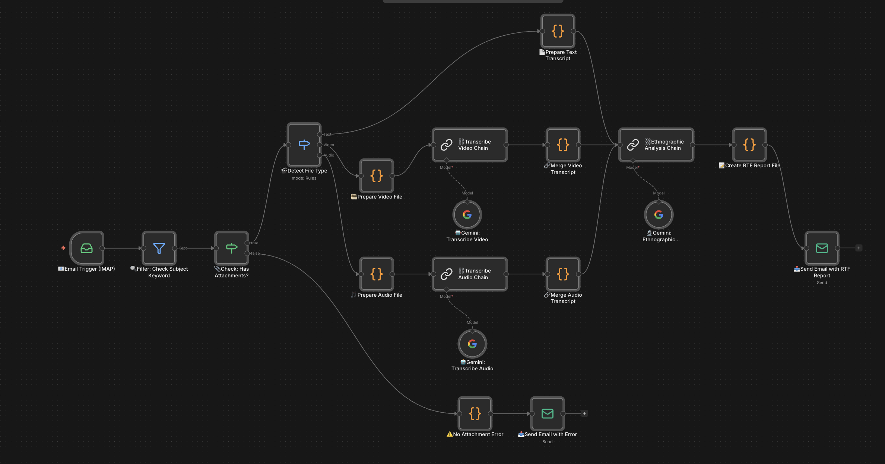

# Ethnographic Research Workflow

An n8n automation that receives research files via email, transcribes audio/video attachments using Google Gemini, and returns a structured ethnographic analysis report as an RTF file.

## Workflow Diagram

### Diagram Walkthrough

The diagram reads left to right and has four distinct layers: **ingestion**, **routing**, **processing**, and **delivery**.

**1. Ingestion (far left)**
The workflow starts with the **Email Trigger (IMAP)** node, which continuously polls an inbox for new emails. Every incoming message is immediately passed to the next node.

**2. Filtering**
The **Filter: Check Subject Keyword** node reads the email subject and only allows messages containing "Ethnographic Research" (case-insensitive) to continue. Everything else is silently dropped.

**3. Attachment Gate**
The **Check: Has Attachments?** node is an If/Else branch:
- **True path (top)** — the email has at least one attachment; flow continues to file-type detection.
- **False path (bottom)** — no attachment found; flow drops straight to the error branch at the bottom of the diagram.

**4. File Type Detection (centre-left)**
The **Detect File Type** switch node inspects the MIME type of `attachment_0` and splits into three named output branches:
- **Text** → top arc → straight to transcript preparation
- **Video** → middle arc → video transcription pipeline
- **Audio** → lower arc → audio transcription pipeline

**5a. Text Branch (top arc)**
**Prepare Text Transcript** decodes the base64-encoded text attachment directly into a plain transcript string. No LLM transcription is needed — the content is ready immediately and flows straight into the Ethnographic Analysis Chain.

**5b. Video Branch (middle)**
**Prepare Video File** bundles the binary attachment with a transcription prompt, then passes it to the **Transcribe Video Chain** (an LLM Chain node). The chain uses **Gemini: Transcribe Video** (Gemini 2.5 Pro, temperature 0.1) as its model — shown connected via the dashed "Model" sub-link below the chain node. The transcript output is caught by **Merge Video Transcript**, which stitches it back together with the original file metadata before sending it downstream.

**5c. Audio Branch (lower middle)**
Mirrors the video branch exactly: **Prepare Audio File** → **Transcribe Audio Chain** + **Gemini: Transcribe Audio** (temperature 0.1) → **Merge Audio Transcript**.

**6. Ethnographic Analysis (centre-right)**
All three branches converge at the **Ethnographic Analysis Chain**. This LLM Chain node sends the transcript to **Gemini: Ethnographic Analysis** (Gemini 2.5 Pro, temperature 0.3, up to 8 192 output tokens) with a structured prompt requesting six report sections: Executive Summary, Key Themes & Patterns, Participant Behaviors & Observations, Cultural Insights, Notable Quotes, and Recommendations. The dashed "Model" link below the chain connects it to the Gemini node.

**7. Report Generation**
**Create RTF Report File** takes the raw Markdown analysis from Gemini and converts it to RTF format — replacing headings, bold text, and bullet points with RTF control words — then base64-encodes the result as a binary attachment ready to be emailed.

**8. Delivery (far right)**
**Send Email with RTF Report** replies to the original sender (resolved via `return-path` header) with the RTF file attached and a summary message in the body.

**Error Path (bottom)**
If the attachment check fails, **No Attachment Error** generates a descriptive error payload, and **Send Email with Error** replies to the sender explaining that no attachment was detected.

## How It Works

1. An email arrives with **"Ethnographic Research"** in the subject line
2. The workflow checks for attachments and routes by file type (text, video, audio)
3. Video and audio files are transcribed via Gemini 2.5 Pro
4. The transcript is analyzed using ethnographic research framing
5. An RTF report is generated and emailed back to the sender

## Workflow Nodes

| Node | Type | Purpose |
|---|---|---|
| 📧 Email Trigger (IMAP) | IMAP Trigger | Listens for incoming emails |
| 🔍 Filter: Check Subject Keyword | Filter | Passes only emails containing "Ethnographic Research" |
| 📎 Check: Has Attachments? | If | Branches on whether an attachment is present |
| 🎬 Detect File Type | Switch | Routes to text, video, or audio branch by MIME type |
| 📄 Prepare Text Transcript | Code | Decodes base64 text attachment into a transcript string |
| 🎞️ Prepare Video File | Code | Prepares video binary and transcription prompt |
| 🎵 Prepare Audio File | Code | Prepares audio binary and transcription prompt |
| ⛓️ Transcribe Video Chain | LLM Chain | Sends video to Gemini for transcription |
| ⛓️ Transcribe Audio Chain | LLM Chain | Sends audio to Gemini for transcription |
| 🤖 Gemini: Transcribe Video | Google Gemini | Runs `gemini-2.5-pro` at temperature 0.1 |
| 🤖 Gemini: Transcribe Audio | Google Gemini | Runs `gemini-2.5-pro` at temperature 0.1 |
| 🔗 Merge Video Transcript | Code | Combines transcription output with original metadata |
| 🔗 Merge Audio Transcript | Code | Combines transcription output with original metadata |
| ⛓️ Ethnographic Analysis Chain | LLM Chain | Sends transcript to Gemini for analysis |
| 🔬 Gemini: Ethnographic Analysis | Google Gemini | Runs `gemini-2.5-pro` at temperature 0.3, max 8192 tokens |
| 📝 Create RTF Report File | Code | Converts Markdown analysis to RTF and base64-encodes it |
| 📤 Send Email with RTF Report | SMTP | Replies to sender with the RTF report attached |
| ⚠️ No Attachment Error | Code | Generates an error message when no attachment is found |
| 📤 Send Email with Error | SMTP | Replies to sender with the error message |

## Report Structure

The generated RTF report contains six sections:

1. **Executive Summary**
2. **Key Themes & Patterns**
3. **Participant Behaviors & Observations**
4. **Cultural Insights**
5. **Notable Quotes**
6. **Recommendations**

## Supported File Types

| Type | MIME prefix | Path |
|---|---|---|
| Text transcript | `text/*` | Decoded directly, no transcription step |
| Video | `video/*` | Transcribed by Gemini before analysis |
| Audio | `audio/*` | Transcribed by Gemini before analysis |

## Setup

### Prerequisites

- A running n8n instance
- An IMAP-enabled email account for receiving submissions
- An SMTP-enabled email account for sending reports
- A Google Gemini (PaLM) API key

### Credentials

Open the workflow in n8n and configure the following credentials:

| Credential | Used by |
|---|---|
| IMAP account | 📧 Email Trigger (IMAP) |
| Google Gemini(PaLM) API | 🤖 Gemini nodes (×3) |
| SMTP account | 📤 Send Email nodes (×2) |

Update the `fromEmail` field in both **Send Email** nodes to your sender address.

### Importing the Workflow

1. Copy `ethnographic-research-workflow.json`
2. In n8n, go to **Workflows → Import from file**
3. Select the JSON file
4. Fill in all credentials marked `YOUR_*`
5. Activate the workflow

## Triggering the Workflow

Send an email to your configured IMAP address with:

- **Subject:** any text containing `Ethnographic Research`
- **Attachment:** a `.txt`, `.csv`, video, or audio file containing the interview content

The reply with the RTF report will be sent to the `return-path` header of the original email.
